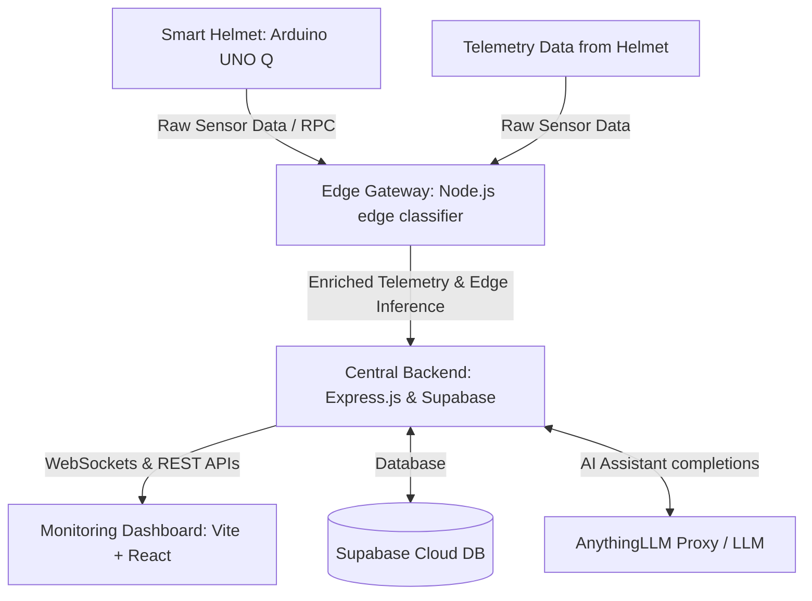

# ⛑️ GuardianAI — Smart Safety Helmet For Miners and Underground workers

An end-to-end, AI-powered smart safety helmet and real-time dashboard ecosystem designed for miners and underground workers. GuardianAI combines on-device hardware sensing, edge gateway intelligence, a centralized cloud API backend, and a rich, interactive real-time monitoring web application.

# Dev names and emails

1.JOSHUA S - joshua.2502110@srec.ac.in\
2.SAI GANESH S V - saiganesh.2402209@srec.ac.in\
3.SRI KISHORE S - srikishore.2402236@srec.ac.in\
4.THOORASHWIN M - thoorashwin.2402248@srec.ac.in\
5.RITHUSON A - rithuson.2502202@srec.ac.in

---

## 🏗️ System Architecture

GuardianAI uses a multi-tiered architecture to guarantee low-latency alerts at the edge, while maintaining full cloud visibility and historical analytics.



1. **Hardware Tier (Arduino UNO Q)**: Combines MCU-level real-time sensing (I2C/Analog/Digital) with an onboard Linux compute module running Bridge RPC communication.
2. **Edge Tier (Gateway)**: A local gateway server that emulates edge/NPU processing. It runs a lightweight inference classifier (under 10ms latency) to check for critical events like falls, gas spikes, inactivity, or abnormal vitals.
3. **Cloud & Central Tier (Backend)**: An Express.js REST API and WebSocket server that handles ingestion, central alert routing, database persistence, and integrates with Cloud AI and LLM APIs.
4. **Presentation Tier (React Frontend)**: A high-fidelity real-time dashboard featuring live maps (Maplibre GL), multi-worker telemetry charts, system status alerts, and scenario simulation.

---

## 🛠️ Components & Features

### 1. Smart Helmet With Edge AI on Arduino UNO Q
* **Power-Aware Sensing**: Low-power state runs when the helmet is off (MAX30102 in HR-only mode, RED LED disabled). The full sensor suite activates only when a worker wears the helmet, conserving power.
* **Biometric & Environmental Sensing**: Real-time heart rate, SpO2, methane (MQ4), carbon monoxide (MQ7), pressure & temperature (BMP280), humidity & temperature (DHT22), and 6-axis motion tracking (MPU6050).
* **Router Bridge RPC**: Exposes direct remote procedure calls to the Linux container for low-latency alerts and controls (e.g. `get_sensor_data`, `set_buzzer`, `trigger_sos`).
* **Hardware Alerts**: A physical buzzer and status LEDs provide immediate physical alerts directly to the worker.

### 2. Edge AI Gateway
* **Sub-10ms Inference**: Emulates Snapdragon NPU inference, running a classification pipeline to flag potential dangers (fall detection, gas leaks, extreme vital anomalies).
* **Data Enrichment**: Adds calculated risk scores and alert flags to incoming raw payloads before forwarding them to the central database.

### 3. Central Backend & Services
* **Real-time Synchronization**: Uses `Socket.io` to stream incoming telemetry and triggered alerts immediately to dashboard clients.
* **Worker & Device Management**: Stores worker records, schedules, and active alerts inside Supabase.
* **AnythingLLM Integration**: Proxies requests to an OpenAI-compatible interface (AnythingLLM) to assist managers with AI-powered safety diagnostics.

### 4. Monitoring Web Application
* **Live Telemetry & Geolocation**: Dynamic rendering of active worker positions, path history, and vital stats.
* **Interactive Map**: Utilizes Maplibre GL with rich customized mapping to display safe geofences and hazard zones.
* **Incident Alerting Panel**: Real-time listing of emergency triggers with alert levels and acknowledgement buttons.
* **Scenario Simulator**: Allows dispatching mock scenarios directly from the dashboard to simulate emergency drills.

---

## 📁 Project Structure

```text
guardian-ai/
├── sketch/
│   └── sketch.ino        # Arduino MCU sketch: sensors, LEDs, buzzer, SOS, Bridge RPC
├── python/
│   ├── main.py           # Linux-side Python app: polls Bridge, WiFi RSSI, SOS handling
│   └── requirements.txt  # Python requirements
├── backend/
│   ├── src/
│   │   ├── index.ts      # Express web app, Socket.io, LLM proxy, Supabase integration
│   │   ├── seed.ts       # Database seeder utility
│   │   ├── routes/       # API endpoints (Auth, Workers, Alerts, Telemetry, Analytics)
│   │   └── lib/          # Utilities and Supabase clients
│   ├── tsconfig.json
│   └── package.json
├── gateway/
│   ├── src/
│   │   ├── index.ts      # Gateway server receiving telemetry and forwarding to backend
│   │   └── edgeClassifier.ts # Rule-based local inference classifier (NPU emulation)
│   ├── tsconfig.json
│   └── package.json
├── frontend/
│   ├── src/
│   │   ├── pages/        # Dashboard panels (Admin, Alerts, Sensor, LiveMap, Monitoring)
│   │   ├── components/   # UI widgets, layout templates, charts, logs
│   │   ├── App.tsx       # Routing and dashboard wrapper
│   │   └── main.tsx
│   ├── package.json
│   └── vite.config.ts
├── Arduino UNO Q/
│   ├── Sketch/
│   │   └── Sketch.ino
│   ├── python/
│        └── main.py
|        └──requirements.py
└── README.md           
```

---

## 🔌 API & Telemetry Data Schema

The Arduino router bridge API emits telemetry following this standardized schema:

```json
{
  "helmetId": "HLM-001",
  "workerId": "EMP-1001",
  "timestamp": 1784119506000,
  "temperature": 28.4,
  "humidity": 55.2,
  "pressure": 1011.32,
  "altitude": 142.6,
  "heartRate": 72.5,
  "spo2": 97.3,
  "gas": {
    "ch4": 0.42,
    "co": 0.31,
    "o2": 20.9
  },
  "motion": {
    "ax": 0.01,
    "ay": -0.98,
    "az": 0.02,
    "gx": 0.1,
    "gy": -0.05,
    "gz": 0.02
  },
  "battery": 92,
  "gps": {
    "lat": 13.0827,
    "lng": 80.2707,
    "fix": true
  },
  "ir": true,
  "sos": false
}
```

If the helmet is removed, a lightweight status is generated:
```json
{ "state": "off" }
```

---

## ⚙️ Setup & Installation

### Hardware (Arduino UNO Q)

#### 1. Wiring & Pin Configuration
Connect the sensors to the Arduino Board as follow:
- **I2C Bus (SDA/SCL)**: Shared between `MAX30102` (Heart rate/SpO2), `MPU6050` (IMU), and `BMP280` (Barometer).
- **Methane (MQ4)**: Analog Input `A0`
- **Carbon Monoxide (MQ7)**: Analog Input `A1`
- **Humidity & Temp (DHT22)**: Digital Pin `D7`
- **Buzzer**: Digital Pin `D9`
- **Green LED**: Digital Pin `D6` (Power Status / Worn)
- **Red LED**: Digital Pin `D5` (SOS / Alarm)
- **SOS Push Button**: Digital Pin `D4` (connected via internal pullup to ground)

#### 2. Arduino IDE Libraries Setup
Install the following dependencies inside the Arduino IDE or via Arduino App Lab:
* `Arduino_RouterBridge`
* `DHT sensor library`
* `Adafruit BMP280 Library`
* `Adafruit MPU6050`
* `Adafruit Unified Sensor`
* `Adafruit BusIO`

#### 3. Upload & Deploy
1. Open `sketch/sketch.ino` in the Arduino IDE or App Lab.
2. Edit constant thresholds at the top of the file to fit your MAX30102 hardware if needed.
3. Flash the code to the UNO Q board.
4. Establish WiFi connectivity on the Linux compute module:
   ```bash
   sudo nmcli dev wifi connect "YOUR_SSID" password "YOUR_PASSWORD"
   hostname -I # confirm IP for SSH
   ```
5. Deploy the Python daemon in the background on the UNO Q Linux container:
   ```bash
   cd python
   pip install -r requirements.txt
   python main.py
   ```

---

### Web Application stack (Localhost Setup)

Follow these instructions to start the central monitoring platform locally.

#### Prerequisites
- Node.js (v18 or higher)
- A Supabase project initialized with standard schema tables (`workers`, `alerts`, `telemetry_history`).

#### 1. Configuration & Env Variables
Create a `.env` file in the root workspace folder, or define individual `.env` files in each subfolder:

**Frontend Config (`frontend/.env`)**:
```env
VITE_API_URL=http://localhost:5000
VITE_GATEWAY_URL=http://localhost:5001
VITE_MAP_STYLE_URL=https://basemaps.cartocdn.com/gl/dark-matter-gl-style/style.json
VITE_SUPABASE_URL=https://your-supabase-url.supabase.co
VITE_SUPABASE_ANON_KEY=your-supabase-anon-key
```

**Backend Config (`backend/.env`)**:
```env
PORT=5000
JWT_SECRET=super_secret_guardian_key_12345_!@
SUPABASE_URL=https://your-supabase-url.supabase.co
SUPABASE_SERVICE_KEY=your-supabase-service-key
SIMULATOR_URL=http://localhost:5002
```

**Gateway Config (`gateway/.env`)**:
```env
GATEWAY_PORT=5001
BACKEND_WS_URL=ws://localhost:5000
BACKEND_HTTP_URL=http://localhost:5000
```

#### 2. Installing Dependencies
Install node dependencies inside each service subfolder:
```bash
# Frontend
cd frontend && npm install

# Central Backend
cd ../backend && npm install

# Edge Gateway
cd ../gateway && npm install

# Simulator
cd ../simulator && npm install
```

#### 3. Database Seeding
Initialize mock data inside your Supabase instance:
```bash
cd backend
npm run seed
```

#### 4. Running Services
Start all the subsystems in separate terminals:

* **Start Central Backend**:
  ```bash
  cd backend
  npm start
  ```
* **Start Edge Gateway**:
  ```bash
  cd gateway
  npm run start
  ```
* **Start Telemetry Simulator (For testing dashboard without physical helmet)**:
  ```bash
  cd simulator
  npm start
  ```
* **Start Frontend Interface**:
  ```bash
  cd frontend
  npm run dev
  ```
Open **[http://localhost:3000](http://localhost:3000)** in your browser to view the interactive dashboard dashboard.

---

## 🛡️ License

This project is licensed under the MIT License - see the LICENSE section in individual files or root documents for details.
Copyright (c) 2026 GuardianAI Team.

## Demo
This Project has been Simulated in Unity Engine for Better Understanding.


